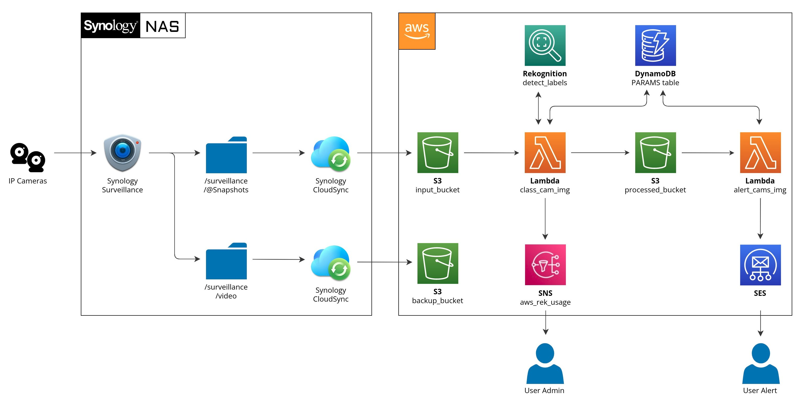

# AWS IP-CAM Human Intrusion Alert

## Introduction

This project describes an affordable and reliable system for almost real-time human intrusion detection and automatic
cloud storage of the video

## Requirements

- Almost any IP-cam (from 30$/ip-cam).
- Synology NAS or any middleware able to capture video and an image stream from IP-cams and upload it to AWS S3 buckets.
  Note that there is a Synology one-time pay licence cost (around 60$) for each IP-cam, but first 2 IP-cams are free.
- An AWS account.
- Estimated monthly budget regarding AWS costs is 0.00$-0.05$ and up to 0.40$ per month (0.10$ per week) IP-cam
  if you have a pet, triggering the detection movement and the human intrusion detection pipeline.

## Pipeline Diagram

Work in progress...
